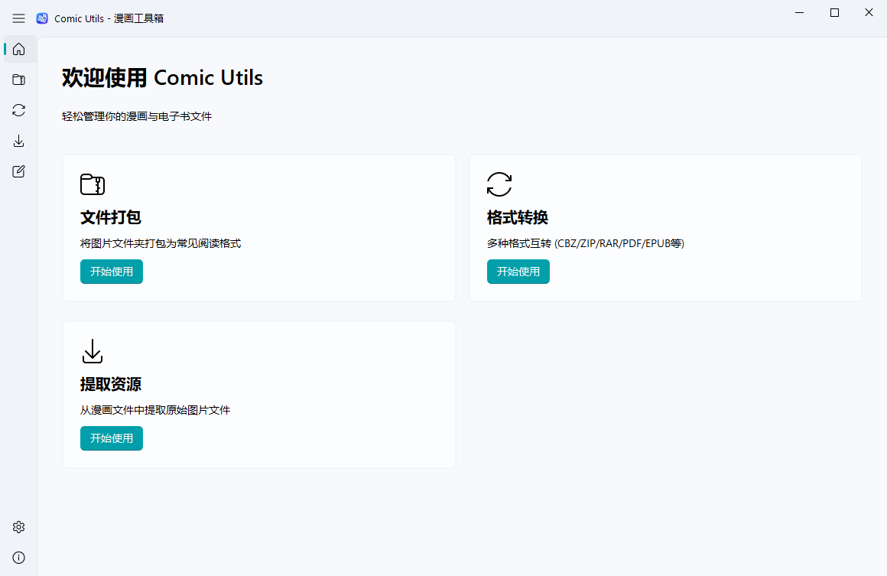
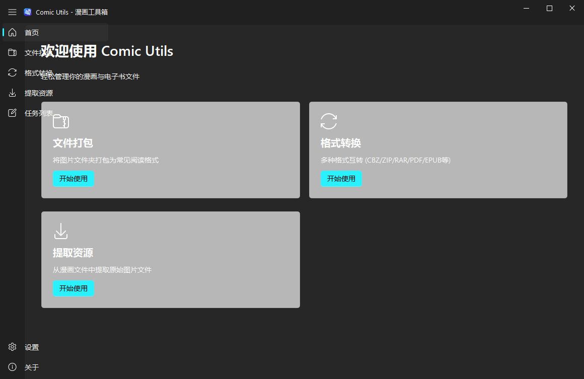

# Comic Utils

<div align="center">


### Modern, High-Performance Comic & Ebook Format Converter, Archiver & Extraction Tool

[](https://github.com/candy-blue/comic-utils/releases)
[](https://www.python.org/)
[](https://github.com/zhiyiYo/PySide6-Fluent-Widgets)
[](LICENSE)
[](https://github.com/candy-blue/comic-utils/releases)

**English** | **[简体中文](README.zh-CN.md)**

</div>

---

## 📖 Overview

**Comic Utils** is a modern, high-performance desktop application designed for comic book enthusiasts, digital manga collectors, and ebook readers. Built from the ground up with the **Windows 11 Fluent Design** language, it seamlessly integrates with native Windows Mica/Acrylic material and accent palettes, delivering an intuitive, responsive, and elegant workflow.

---

## ✨ Features

- 🎨 **Native Windows 11 Fluent Aesthetics**
  - Inherits native Windows system accent colors and dark/light modes.
  - Real-time seamless live theme switching (**Light / Dark / Follow System**) without restarting.
  - Clean collapsible navigation sidebar with standardized setting cards.
  - **Sleek Rounded Scrollbars**: Windows 11-style ultra-thin transparent scrollbars with smooth hover expand animations.
- 📦 **Smart Folder Packaging**
  - Bundle image folders (chapters, volumes) into standard comic archives or ebooks with a single click.
  - **Recursive Subfolder Scanning**: Automatically scans parent comic folders containing multiple chapter/volume directories and generates separate archives for each.
- 🔄 **Batch Format Converter**
  - Convert existing comic archives and ebooks across multiple popular formats.
  - Multi-threaded asynchronous processing ensures fast, non-blocking batch operations.
- 📂 **Lossless Resource Extraction**
  - Unpack `.cbz`, `.zip`, `.epub`, `.pdf`, `.rar`, `.7z`, or `.mobi` archives back into clean image directories.
- 📋 **Interactive Task Management Center**
  - Visual real-time progress indicators and live statuses (`Pending`, `Processing`, `Paused`, `Completed`, `Failed`).
  - **Category Tabs**: Instant filtering by `All Tasks`, `Folder Packaging`, `Format Converter`, or `Extract Resources`.
  - **Granular Controls**: Individual task pause/resume and deletion, plus batch pause/resume, clear completed, and clear all.
- 🌐 **Instant Multi-Language Switching (i18n)**
  - Seamlessly switch between **English** and **简体中文** in real time across the entire UI.
- 🚀 **Built-in Smart Updater**
  - Automatic GitHub version check with rate-limit fallback.
  - In-app one-click update downloader featuring live progress percentage, downloaded size, and cancel support.

---

## 🖼️ Screenshots

<div align="center">

### Home Interface (Light & Dark Theme)



<br/><br/>

### Folder Packaging & Recursive Scan Option


<br/><br/>

### Multi-Task Processing Center


</div>

---

## 📊 Supported Formats

| Feature | Supported Input | Supported Output |
| :--- | :--- | :--- |
| **Folder Packaging** | Image directories (`.jpg`, `.png`, `.webp`, `.gif`, `.bmp`) | `.cbz`, `.zip`, `.pdf`, `.epub`, `.7z` |
| **Format Converter** | `.cbz`, `.zip`, `.rar`, `.pdf`, `.epub`, `.mobi`, `.7z` | `.cbz`, `.zip`, `.pdf`, `.epub`, `.7z` |
| **Extract Images** | `.cbz`, `.zip`, `.rar`, `.pdf`, `.epub`, `.mobi`, `.7z` | Folder of extracted images |

> **Notes**:
> - **RAR Format**: Extraction and conversion from RAR are supported. Creating new RAR archives is restricted by proprietary format licensing.
> - **MOBI Format**: Deprecated format; converting `.mobi` files to modern **`.epub`** or **`.cbz`** is recommended.

---

## 🚀 Getting Started

### 1. Direct Download (End Users)
1. Download the latest `ComicUtils.exe` from [GitHub Releases](https://github.com/candy-blue/comic-utils/releases).
2. Double-click `ComicUtils.exe` to run. Portable, standalone, no installation required.

### 2. Run from Source (Developers)
Requires **Python 3.10+**:

```bash
# 1. Clone the repository
git clone https://github.com/candy-blue/comic-utils.git
cd comic-utils

# 2. Install dependencies
pip install -r requirements.txt

# 3. Launch application
python main.py
```

### 3. Build Standalone Executable
The repository includes an automated Windows build script `build.bat` with native Win32 PE icon resource compilation:

```bash
# Run build script
build.bat
```

The output executable will be placed in **`dist\ComicUtils.exe`**.

---

## 🤝 Contributing & Feedback

Contributions, issues, and feature requests are welcome!
- **Submit Feedback / Report Bugs**: [GitHub Issues](https://github.com/candy-blue/comic-utils/issues)
- **Repository**: [https://github.com/candy-blue/comic-utils](https://github.com/candy-blue/comic-utils)

---

## 📄 License

This project is licensed under the [MIT License](LICENSE).
